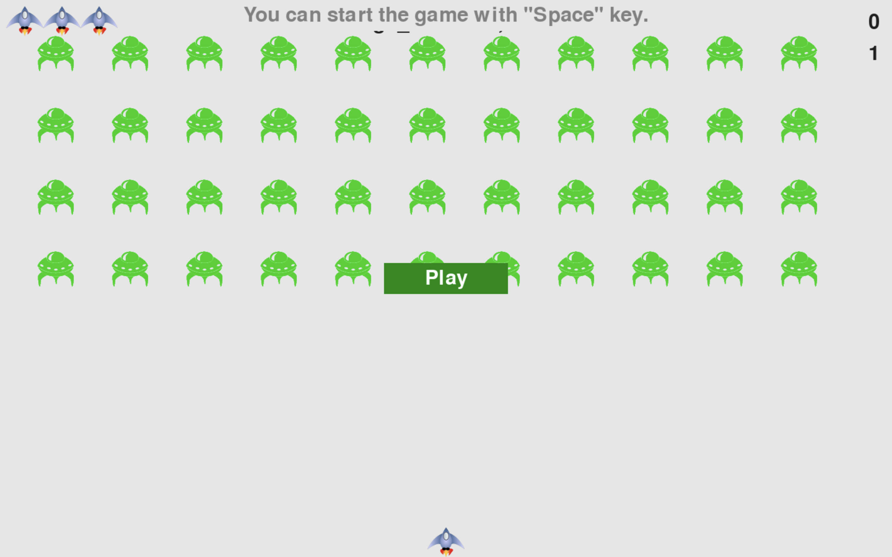
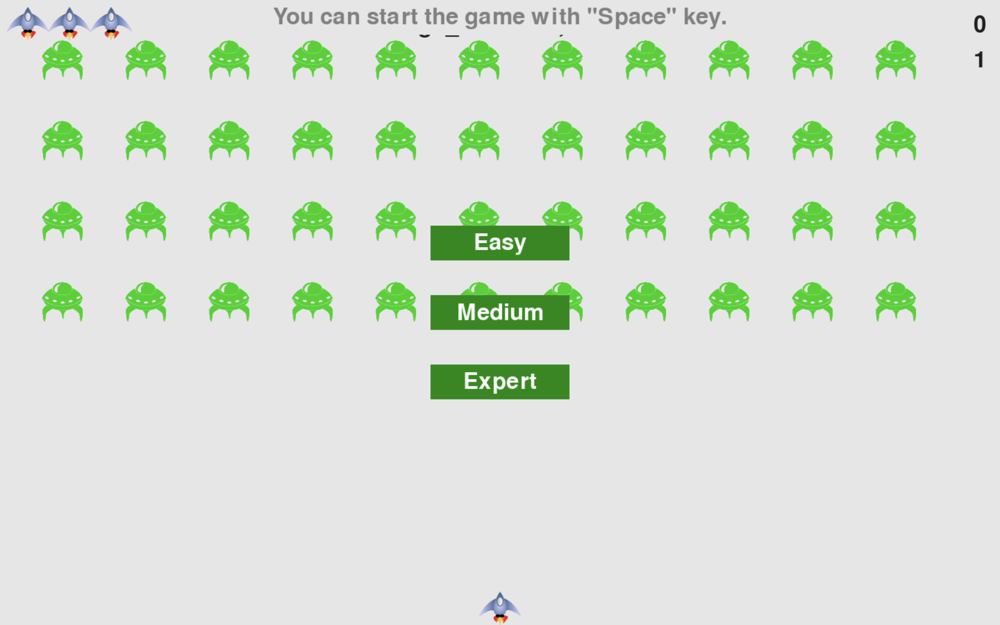
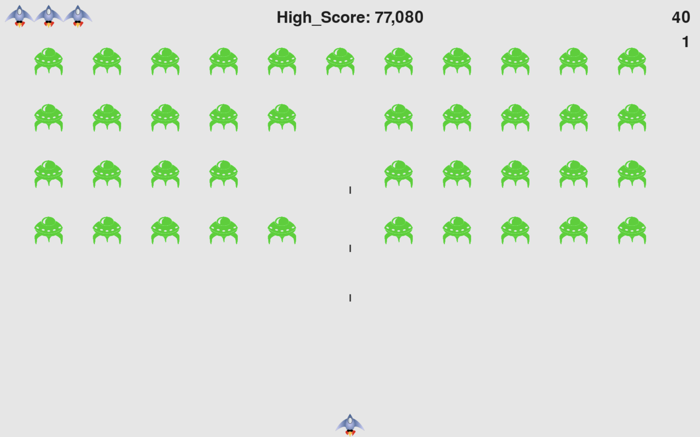

# Alien Invasion

## Introduction
Alien Invasion is an action-packed 2D arcade shooter where your mission is to 
shoot down a wave of aliens and defend your ship. Each time you clear a fleet,
a new fleet appears, and its movement intensifies, making it harder to achieve
a new high score.

## Gameplay
### Objective: 
* Shoot down the wave and defend your ship.

### Challenges:
* Each fleet you destroy is quickly replaced by a more challenging one. 
Your goal is to survive as long as possible and rack up a high score.

### Features:
* Endless Waves: As long as you survive, The alien fleet keeps coming.
* Highscore: Compete against yourself to set new highscore.

## Screenshots:
Here is the current condition of the game:

 

## Installation:
* Clone the repository.
* Install requirements from requirements.txt, **ex: pip install requirements.txt**
* Run the Game

## Contribution:
if you found a issue or want to improve this project, Fell free
to contribute by following steps:
* Fork a repository and create a new branch for your changes.
* Make your changes and commit them with clear messages.
* Submit a pull request for review.

## Credit:
**Eric Matthes**